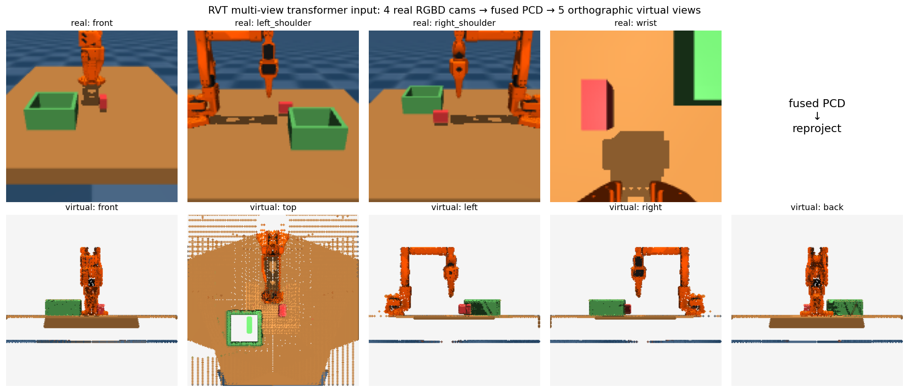

# rvt-lerobot

**Bringing RVT-style multi-view transformer policies to the LeRobot ecosystem.**

LeRobot ships ACT, Diffusion Policy, VQ-BeT, π0, SmolVLA — all RGB-only,
dense-action policies. There is no 3D / keyframe-based policy in the family.
[RVT](https://github.com/NVlabs/RVT) (Robotic View Transformer, CoRL 2023) is
the canonical one. This repo is a minimal bridge: a MuJoCo SO-ARM100 env with 4
RGBD cameras, a PerAct/RLBench-format data dumper, and a LeRobot-compatible
policy wrapper around RVT.



> **What you're looking at.** Top row: 4 real RGBD cameras (front, left/right
> shoulder, wrist) rendered from a single MuJoCo step. Bottom row: 5
> orthographic *virtual* views reprojected from the fused point cloud. The RVT
> transformer attends across the bottom row. The reprojection is not learned —
> it's geometric. The network sees the same canonical viewpoints every time.

## How RVT works in one paragraph

`RGBD from N real cameras → unproject each to a 3D point cloud in world frame
→ concatenate → re-render from K = 5 fixed orthographic virtual cameras (front,
top, left, right, back) → patchify + ViT with cross-view attention → per-pixel
heatmaps on each virtual view → argmax in 3D gives the next end-effector
keypose; rotation + gripper open are auxiliary heads.` RVT predicts the *next
keyframe*, not the next dense action.

## What's in the box

```
rvt_lerobot/
├── envs/so_arm_rvt_env.py        SO-ARM100 + 4 RGBD cameras, extrinsics/intrinsics export
├── data/                         NOT YET IMPLEMENTED. The PerAct-format writer and the
│                                 scripted demo collector are planned, not written.
├── visualize/virtual_views.py    PCD fusion + 5 orthographic re-renders (the hero figure)
└── policy/rvt_policy.py          LeRobot PreTrainedPolicy-shaped wrapper (stub)
assets/
├── so_arm_scene/                 MJCF: SO-ARM100 + RLBench camera rig
└── virtual_views_hero.png        the figure above
external/RVT/                     upstream NVlabs/RVT clone (training code)
```

## Quickstart

> **Status: work in progress.** `rvt_lerobot.data` does not exist yet, so step 1 below
> does not run on a fresh clone. The environment, the virtual-view reprojection and the
> policy wrapper are real; data collection is not written. Step 2 works against an
> episode you supply yourself.

```bash
# 1) NOT IMPLEMENTED YET: collect a tiny dataset (PerAct format, 3 episodes)
# MUJOCO_GL=egl PYTHONPATH=. python -m rvt_lerobot.data.collect --num 3 --out data/demos

# 2) Reproject one frame into 5 virtual views (the hero figure)
PYTHONPATH=. python -m rvt_lerobot.visualize.virtual_views \
    --episode data/demos/train/put_block_in_box/all_variations/episodes/episode0 \
    --frame 0 --out virtual_views.png
```

## On-disk format

Each episode matches what `peract_colab.rlbench.utils.get_stored_demo` expects:

```
episodeN/
├── low_dim_obs.pkl          # list[Observation] with .misc['<cam>_camera_extrinsics' / '_intrinsics' / '_near' / '_far'], .gripper_open, .gripper_pose
├── variation_number.pkl
├── variation_descriptions.pkl
├── front_rgb/{i}.png        front_depth/{i}.png         # depth packed as 24-bit RGB PNG
├── left_shoulder_rgb/...    left_shoulder_depth/...
├── right_shoulder_rgb/...   right_shoulder_depth/...
└── wrist_rgb/...            wrist_depth/...
```

This means the data drops straight into RVT's training pipeline:

```bash
cd external/RVT
python train.py task=put_block_in_box dataset.data_folder=../../data/demos
```

## Path to a real LeRobot contribution

The policy file is intentionally a stub. To upstream:

1. Replace `RVTConfigStub` with a `PreTrainedConfig` subclass registered as `"rvt"`.
2. Replace `RVTPolicyStub` with a `PreTrainedPolicy` subclass that constructs
   `rvt.models.rvt_agent.RVTAgent` in `__init__` and delegates `forward` /
   `select_action` to it.
3. Add a LeRobot dataset processor that emits the per-camera `point_cloud`
   tensors RVT expects (unproject from `observation.depths.{cam}` + extrinsics).
4. Register in `lerobot.policies.factory`.

That's the contribution this scaffolding is shaped for.

## Known limitations

- The scripted demo policy is open-loop joint waypoints — illustrative, not
  reliably successful. Swap in proper IK or teleop.
- RVT's training code under `external/RVT/` has heavy deps (CLIP, PyTorch3D for
  RVT-1, custom CUDA for RVT-2) that don't all install cleanly on Jetson aarch64.
  The data pipeline + visualizer are dep-light and run anywhere.
- Keyframe extraction is finite-difference-on-joints, not the true RLBench
  stopped-buffer heuristic. Good enough for sanity-checking the format.

## Credits

- [NVlabs/RVT](https://github.com/NVlabs/RVT) — the model.
- [peract/peract_colab](https://github.com/peract/peract_colab) — the on-disk
  format spec.
- SO-ARM100 model from the LeRobot community.
